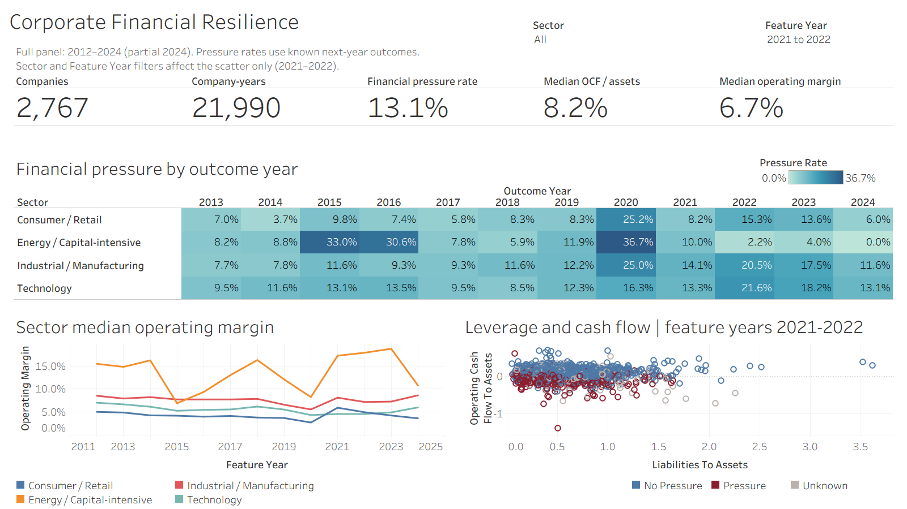
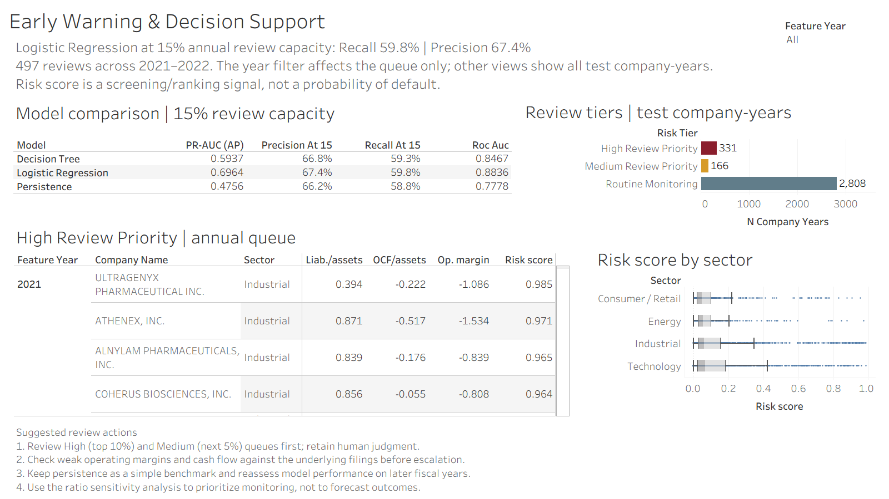

# Corporate Financial Risk Analytics

A Business Analytics portfolio project by a second-year Statistics student at McMaster University. It combines financial-statement cleaning, SQL, statistical comparisons and interpretable models to prioritize companies for financial-pressure review.

## Business Problem

An analyst has limited time to review a large set of companies. Which company-years show warning signals that deserve closer investigation, and what share of historical pressure cases can be found within a 15% review capacity?

The risk score is a screening and ranking signal. It is not a probability of default, credit rating or automatic decision tool. The workflow is relevant to financial analysis and supplier or counterparty monitoring; its usefulness in those settings still requires independent validation.

## Data and Scope

- **2,767 companies and 21,990 company-years**, covering feature years 2012–2024. Revenue is at least $100M and assets at least $1M for retained observations.
- Four SIC-based groups: Industrial / Manufacturing, Energy / Capital-intensive, Consumer / Retail, and Technology / Software / Electronics. Financial institutions and other unmapped industries are excluded.
- SEC quarterly financial-statement datasets from 2013–2024 supply annual 10-K figures. FRED supplies the federal funds rate, CPI inflation and industrial-production growth.
- Each company has at least three retained observations; gaps are allowed in the panel, but lagged features and next-year labels require adjacent fiscal years.
- **17,219 known labels; 4,771 unknown labels.** Pressure prevalence is **13.1%** among known labels. Fiscal 2024 has only **280 observations** and should not be treated as a complete-year benchmark.

Raw SEC files total several GB and are not committed. The [processed panel](data/processed/company_year_panel.csv), [scores](data/processed/model_scores.csv), and saved notebook outputs are included so readers can inspect and rerun the main analysis without those downloads. [Source and download details](data/README.md).

## Analysis Workflow

1. [Acquire data](notebooks/01_data_acquisition.ipynb): optional SEC and FRED downloads.
2. [Clean and engineer features](notebooks/02_data_cleaning.ipynb): tag priorities, annual periods, company-year deduplication, ratios, adjacent-year changes, target construction and macro joins.
3. [Explore and compare](notebooks/03_eda_and_statistics.ipynb): missingness, sector medians, outcome-year pressure rates, correlations and descriptive statistical tests.
4. [Model financial pressure](notebooks/04_risk_modeling.ipynb): baselines, Logistic Regression, a shallow Decision Tree and capacity evaluation.
5. [Analyze sensitivity](notebooks/05_scenario_and_decision_analysis.ipynb): hypothetical input changes and seven Tableau exports.
6. [Query the panel](sql/business_queries.sql) and inspect the [Tableau dashboards](dashboard/README.md).

## Target Definition

For feature year `t`, `next_year_financial_pressure` is 1 when at least two of these signals occur in the same company's actual fiscal year `t+1`:

- Operating income / revenue < 0.
- Operating cash flow / total assets < 0.
- Revenue growth from `t` to `t+1` ≤ −10%.

It is 0 when all three signals are computable and fewer than two occur. A missing next year or incomplete inputs produce an unknown label, excluded from rates and model evaluation. [Detailed definition](methodology/target_definition.md).

## Models and Time-Based Validation

The models use 17 numeric features and sector indicators. Identifiers are excluded. Logistic Regression provides a sortable score and readable conditional coefficients; the depth-4 Decision Tree offers simple threshold rules. Majority-class and current-pressure persistence baselines provide context.

Feature years **2014–2018 train**, **2019–2020 validate**, and **2021–2022 test**. Numeric clipping bounds (1st/99th percentiles), clipped medians, sector categories and scaling are learned from training data alone. Validation average precision selects the Logistic Regression class weighting; the final selection is unweighted. Tree depth 4 and minimum leaf size 50 are fixed. Test results do not select settings.

FRED inputs are **contemporaneous annual values**, matched by the fiscal-year number. They are not lagged or reconstructed from historical vintages. This is a retrospective temporal holdout, not a filing-date investment or credit backtest.

## Verified Test Results

Test data contain **3,305 company-years and 560 pressure cases**. PR-AUC below is average precision. Precision and recall use threshold 0.5; capacity metrics use within-year ranking.

| Model | PR-AUC (AP) | ROC-AUC | Precision | Recall | Recall at 15% | Precision at 15% |
|---|---:|---:|---:|---:|---:|---:|
| Persistence | 47.6% | 77.8% | 66.3% | 62.0% | 58.8% | 66.2% |
| Logistic Regression | 69.6% | 88.4% | 83.7% | 37.5% | 59.8% | 67.4% |
| Decision Tree | 59.4% | 84.7% | 73.0% | 51.2% | 59.3% | 66.8% |

Persistence remains competitive: its F1 is 64.1%, versus 51.8% for Logistic Regression and 60.2% for the tree. Logistic Regression has the strongest ranking metrics in this holdout, but its small capacity advantage is not evidence of a reliable commercial improvement. The majority baseline has 83.1% accuracy and zero positive-case recall.

## Review-Capacity Decision

Within each test feature year, sort by score descending and ten-character CIK ascending to break ties. High contains `ceil(10% × n)` company-years; High plus Medium contains `ceil(15% × n)`; the rest receive Routine Monitoring. Stable sorting makes tied tree and persistence scores reproducible. CIK breaks ties only and has no risk meaning.

Across the test years, this creates **331 High, 166 Medium and 2,808 Routine** observations. Reviewing High plus Medium means **497 reviews**, finding **335 of 560 pressure cases**: Recall **59.8%**, Precision **67.4%**. Annual rounding makes coverage slightly above 15%. At 20% capacity, Logistic Regression recall rises to **68.8%**, while precision falls to **58.2%**. A company can appear in both test years.

## Tableau Decision Support





The [packaged workbook](dashboard/corporate_risk_dashboard.twbx) contains its local data. Dashboard 1 identifies sector patterns and distinguishes feature-year ratios from outcome-year pressure rates; its Sector and Feature Year filters affect the scatter only. Dashboard 2 compares models and supports review prioritization. It defaults to all test years, with an optional year filter for the annual review queue only. Model metrics, tier counts and sector box plots retain both test years. [Data sources and filter scope](dashboard/README.md).

## Key Findings

- Pressure prevalence reaches **23.5% in outcome year 2020**, based on 2019 financials; the dashboard excludes unknown labels from the denominator.
- Future-pressure observations have lower current operating margins and operating cash flow/assets. Training-bound clipped mean differences are about **−24.3 and −9.0 percentage points**, with standardized differences around −1.0. These are retrospective associations.
- Median liabilities/assets ranges from about **52.8% in Technology to 62.5% in Consumer**. Sector context matters, and missing liabilities are substantial: **6,320 company-years**.
- The combined partial-feature sensitivity scenario moves **24 company-years from Medium to High** using fixed baseline boundaries. It is a hypothetical sensitivity result, not a forecast of deterioration.

## Business Recommendations

1. Start with the annual High and Medium queue, then review filings and context before taking action; the 15% queue still misses about 40% of observed pressure cases.
2. Examine operating margin and cash flow together, using sector peers to interpret leverage and missing data.
3. Keep persistence as a benchmark. The model's capacity advantage is modest and should be checked in additional periods before operational use.
4. Use sensitivity changes to identify borderline cases for further investigation. Fixed-boundary scenario counts can exceed the baseline review capacity.

## Limitations

The analytical target is not default. Eligibility filters, missing tags and company coverage can introduce selection bias. Sector membership may change over time. Annual filings are selected retrospectively, filing dates are not preserved in the supplied panel, and latest annual macro values may be revised or unavailable at a historical filing date. Observations from the same company and common year shocks are dependent, so simple statistical intervals and p-values are descriptive approximations. The chronological split does not guarantee generalization to unseen companies.

Notebook 01–02 extraction code was statically checked; omitted raw files prevented a full source rebuild. Supplied-panel labels, adjacent-year features and volatility were checked directly. Revised strict duration and duplicate-fact rules may change a future raw rebuild. [Full limitations](methodology/limitations.md) and [variable definitions](data_dictionary/variables.md).

## Repository Structure

```text
notebooks/          Five notebooks and a small shared analysis helper
data/processed/     Company-year panel and final model scores
data_dictionary/    Variables and XBRL tag priorities
methodology/        Target definition and limitations
sql/                Schema, loader and 12 business queries
dashboard/          Packaged Tableau workbook and seven CSV sources
images/             Two Tableau dashboard exports
tests/              Key rule and result checks
```

## Reproduction Steps

Use Python 3.13 and an isolated environment outside the repository. Install the validated direct dependencies:

```bash
python -m pip install -r requirements.txt
python -m jupyterlab
```

Run Notebook **03 → 04 → 05** in order using that environment's kernel. Notebooks support starting Jupyter from the root or any subfolder. Notebook 04 replaces baseline scores; Notebook 05 verifies model agreement and adds sensitivity scores and Tableau CSVs. For an optional full raw rebuild, follow [data instructions](data/README.md), then run 01–02 first.

From the repository root:

```bash
python sql/load_data.py
python -m unittest discover -s tests -v
```

The loader creates the ignored `data/processed/risk.db`. Execute all statements in `sql/business_queries.sql` with a SQLite client. Open the packaged workbook locally in Tableau Desktop. After changing the Python exports, reconnect its seven CSV sources to the updated files in `dashboard/data/`, save the package, and export both dashboard images again.

Validation for this release: Notebook 03–05 executed and saved; Notebook 01–02 statically checked; all 12 SQL queries executed and checked against exported aggregates; six unittest checks passed. No raw-data download is needed for this route.
